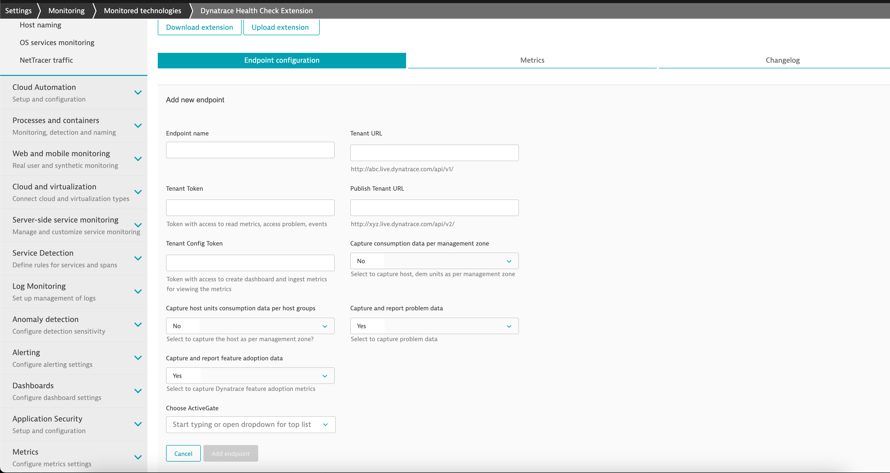
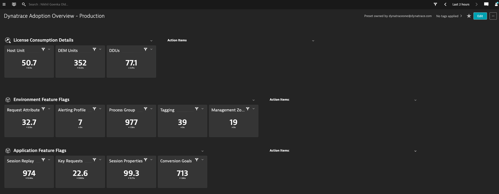
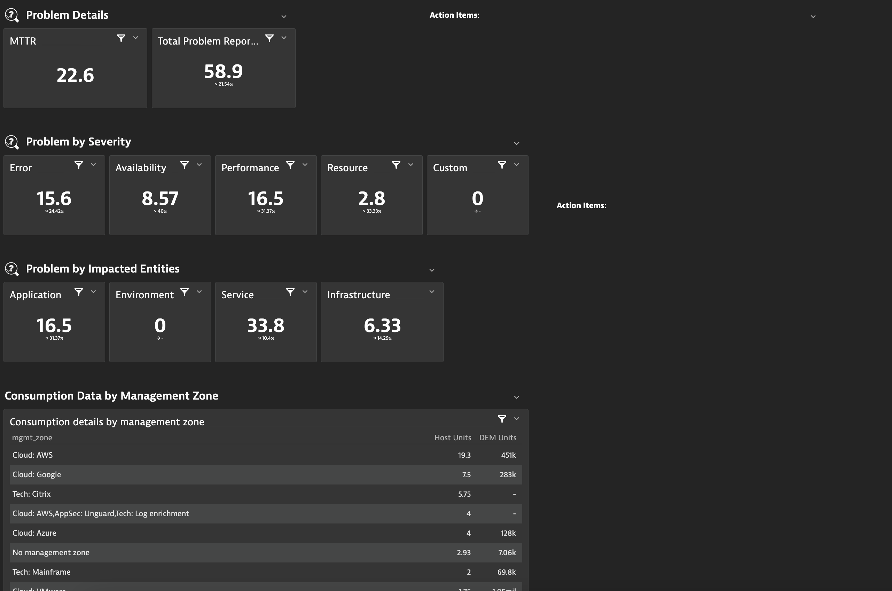

# Dynatrace Health Extension

## Get Started

### What is Dynatrace Health Tool Extension?

Dynatrace Health Tool Extension is an activeGate extension that is developed to pull and report key metrics. It leverages Dynatrace APIs to pull the metrics from the configured tenant. It will enable your customer to get a single pane of all the different health metrics in the tenant itself highlighting some of the usage and adoption features in Dynatrace.

### How does it work?

End-user uploads the extension on an activeGate and configure the endpoint. Once configured, they will start receiving the data and the data would be available a dashboard for that endpoint.  

### Features?

The extension reports the following set of metrics:  
· **License Consumption Insight:** highlighting the current usage of DEM, DDUs, Host Units, Host Units.  
· **Environment Feature flags:** The extension would report on the different feature flags that are currently being used in the environment (like Request attributes, Alerting
profiles. etc.)  
· **Problem Details:** this section would report on the MTTR, and the total number of problems received in the environment in the past month.  
· **Problem by Severity and Impacted Entities**: Dynatrace received problems classified by different severity along with the different entities (like Environment, Services, etc.)  
· **License consumption by management zone:** This section will highlight the license utilization by management zone (once enabled).  
· **License consumption by host group:** This section will highlight the license utilization by host groups (once enabled).

## Guides

### Deploy Extension

1. Within Dynatrace, navigate to **Settings >> Monitored technologies >> Custom extensions** tab  
   

2. Open `Dynatrace Health Check Extension` and configure it.  
   

#### Configurables

**Endpoint name** The name that you want to refer the tenant with.  
**Tenant URL** The tenant-URL you would like to fetch data from.  
**Tenant Token** Token generated with access to read metrics, access problems, events. For details on how to generate token, refer to [help link](https://www.dynatrace.com/support/help/shortlink/token)  
**Tenant Config Token** Token generated with permissions to ingest metrics, create dashboard.  
**Capture consumption data per management zone** Flag to capture consumption data (Host Units, DEM, DDU) and slice it per management zone.  
**Capture host unit consumption data per host zone** Flag to capture Host Units and slice it as per host group.

3. Once configured, successful extension start. It should display the Ok status.

> The extension might take upto 2 minutes to initialize for the first run.

### Look around

1. Navigate to Technologies and find `Dynatrace Feature Adoption Metrics`  
   

2. The Group page lets you analyze the group and view the performance of its members.  
   

3. Analyze various chart types on device page by navigating to the group instance (endpoint)  
   

4. Lastly, a dashboard will be created for each of the endpoint for a quick view of each endpoint.  
     
   

> Note: Consumption data per management-zone/host-group is available only on the dashboard view or under Data explorer.

### Additional use-cases

Whilst the extension generates the metrics and plot these onto the dashboard, there are some other features that you can leverage by doing additional configuration

#### Dashboard Reports

End-user can subscribe to get the dashboard reports weekly or monthly. More details on how to can be found in our help [documentation link](https://www.dynatrace.com/support/help/shortlink/dashboard-reports)  

#### Single value trend

Navigate to the `Data Explorer` screen for a specific metric and set expected thresholds for a specific metric. This can be powerful to get a quick view of say **MTTR**, etc.  

#### Setting custom alerts

You can setup custom alerts on any of the generated metrics so as to be alerted for any abberations. This could be particularly useful for use-cases wherein you as an end-user would like a specific group to be notified once their consumption goes beyond a threshold. To setup a custom alert, navigate to **Settings > Anomaly Detection >> Custom events for alerting** and set the threshold.  

In the above screenshot, a custom alert is setup for management zone `Cloud:AWS` to be alerted whenever the host consumption in endpoint `Non-prod` breaches 200.

## Quick links

### License and bill of materials

Extension would lead to DDU consumption. A fully configured endpoint would consume **250 DDUs** a month for about **15 management zones and 10 host-group**. For more details on DDU consumption, refer to [help link](https://www.dynatrace.com/support/help/shortlink/metric-cost-calculation).

### How long does it take for data to reflect?

Extension has different set of metrics which are consumed at different time interval considering/assuming the criticality of a specific group of metrics.

#### License consumption

The license consumption is updated every hour including the consumption per management zone, host group.

> Note: The consumption metrics are pulled using API, so if the extension is not running the data would be lost during that time. So, this consumption data should be considered as a guideline and more accurate consumption refer to https://myaccount.dynatrace.com (SaaS) or CMC.

#### Environment Flags

The key feature flags are likely not to be changed frequently moreso for a Production environment, so these metrics are pulled and updated every 30 days. So, the first set of environment flag would be available only after 30-days. Lastly, the dashboard considers last 30 days while showing the trend for these metrics.

#### Problem Data and Application Data

The problem related metrics are pulled and updated every day once every 24-hours. The first set of problem data and application data would be available after 24-hours. Lastly, the dashboard considers the dashboard considers last 24-hours while showing the trend for these metrics.

#### Consumption Data per management zone

The consumption metrics (consumption.hostUnits, consumption.demUnits, consumption.ddus) is pulled and pushed every hour.

> NOTE: If there are hosts appearing in multiple management zone, the consumption will be calculated multiple times.

#### Consumption Data per host group

The consumption metrics per host group(consumption.hostUnits) is pulled and pushed every hour.
